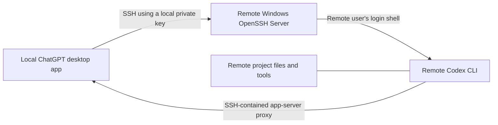

# Codex Remote Projects on Windows over SSH

> A community guide for connecting the ChatGPT desktop app to a project on a remote Windows host through SSH—without exposing Codex app-server traffic to the public internet.

[繁體中文](README.zh-TW.md)

> **Scope:** This is community documentation, not an official OpenAI project. It is a Windows reference for SSH remote projects—not a universal solution for every non-Linux host. It does not control a Windows desktop or bypass normal Windows authorization.

## What this is—and is not

| Feature | Covered here? | Meaning |
| --- | --- | --- |
| SSH remote projects | Yes | Codex chats run commands and edit files on the remote host. |
| ChatGPT Remote Control | No | A separate device-pairing feature for controlling a signed-in desktop host. |
| Public app-server endpoint | No | Never expose the app-server transport to a public or untrusted shared network. |
| Passwords in configuration | No | Use SSH public-key authentication; never commit passwords, private keys, tokens, or real host details. |

## How it works



The desktop app reads concrete SSH aliases from `~/.ssh/config`, resolves them with OpenSSH, and starts the remote Codex app server through the remote user's login shell. `codex` must therefore be on that shell's `PATH`.

## Status and verification boundary

**Last reviewed:** 2026-08-16. This guide is based on one community reproduction, not a compatibility guarantee. The optional reference bridge source is experimental and has only local build/self-test coverage in this repository; validate it on an isolated host before relying on it.

| Component | Community reference baseline |
| --- | --- |
| ChatGPT desktop app package | `26.810.7004.0` |
| Remote Codex CLI | `0.147.0` |
| Windows OpenSSH server banner | `9.5p2` |
| Git Bash | `5.3.15` |

OpenAI documents generic SSH-host remote projects: concrete aliases, a usable remote login shell, and `codex` on that shell's `PATH`. It does **not** prescribe Git Bash or endorse a particular Windows bridge. Treat all Windows shell-bridge guidance here as community-tested, advanced troubleshooting.

## Prerequisites

### Local computer

- ChatGPT desktop app with Codex access.
- OpenSSH client.
- A dedicated private SSH key stored only in the local user profile.

### Remote Windows host

- Windows OpenSSH Server, reachable only over LAN, VPN, or a mesh network.
- A dedicated, least-privilege Windows user.
- Codex CLI installed and authenticated for that remote user.
- A login shell where `codex --version` succeeds.
- A remote project folder.

> Windows note: Windows OpenSSH deployments differ. This guide uses a POSIX-compatible login shell such as Git Bash because the remote bootstrap is shell-oriented. Verify the shell and `PATH` on your own host before adding it to Codex.

## Quick setup

### 1. Create a dedicated SSH key locally

In local PowerShell:

```powershell
ssh-keygen -t ed25519 `
  -f "$env:USERPROFILE\.ssh\id_ed25519_codex_win" `
  -C "codex-windows-remote"
```

Keep `id_ed25519_codex_win` private. Install only `id_ed25519_codex_win.pub` on the remote host.

### 2. Install the public key on the remote host

Using an existing secure administrative route, add the public-key line to:

```text
C:\Users\<remote-user>\.ssh\authorized_keys
```

Use restrictive ownership and ACLs on `.ssh` and `authorized_keys`. Prefer a non-administrator account dedicated to this purpose. Test the key in a second session before changing server authentication policy.

If you administer the SSH server and intend to disable passwords, do that only after key authentication and a recovery path are verified:

```text
PubkeyAuthentication yes
PasswordAuthentication no
KbdInteractiveAuthentication no
```

### 3. Add a concrete SSH alias locally

Create or update `%USERPROFILE%\.ssh\config`:

```sshconfig
Host codex-win
    HostName <host-name-or-private-address>
    User <remote-user>
    IdentityFile ~/.ssh/id_ed25519_codex_win
    IdentitiesOnly yes
    PreferredAuthentications publickey
    PasswordAuthentication no
    KbdInteractiveAuthentication no
```

Use a literal alias such as `codex-win`; pattern-only `Host` entries are not discoverable by Codex.

### 4. Verify before using the desktop app

```powershell
ssh -o BatchMode=yes codex-win "codex --version"
ssh -G codex-win
```

On the remote login shell, also check:

```bash
command -v codex
codex --version
printf 'SHELL=%s\n' "$SHELL"
```

Then run the [manual preflight](docs/preflight.md). A successful `codex --version` alone can be a false positive on Windows: it does not prove that Codex's multiline POSIX bootstrap and clean stdio proxy will work.

### 5. Add the remote project in the desktop app

1. Open **Settings → Connections → SSH**.
2. Add or enable `codex-win`.
3. Choose the remote project folder.
4. Start a chat in that remote project.

Commands, files, tools, credentials, and approvals belong to the remote host and remote user. Do not manually expose the app-server transport or create a public WebSocket endpoint.

## Windows-specific troubleshooting

| Symptom | Likely meaning | Safe check |
| --- | --- | --- |
| `Permission denied (publickey)` | Key, account, or ACL problem | `ssh -vvv codex-win` |
| The host is absent from the app | Alias is not concrete or config cannot be resolved | `ssh -G codex-win` |
| Authenticated, then `codex: command not found` | Login-shell `PATH` is incomplete | `command -v codex` on the remote shell |
| `unexpected EOF` or quote errors after authentication | Windows SSH may be passing a POSIX bootstrap through an incompatible command interpreter | Validate the configured login shell; use a reviewed bridge only as an advanced workaround |
| `socket hangup` | Network/sleep/app state, CLI-version drift, noisy shell output, or a stale control process/socket can all contribute | Check reachability, host sleep, Desktop and CLI versions, then sanitized metadata-only logs; never delete a socket owned by a live process |

### Advanced Windows shell workaround

Some Windows OpenSSH installations default to `cmd.exe`, which can corrupt multi-line POSIX shell bootstrap commands. The preferred fix is an administrator-reviewed POSIX-compatible default login shell with a correct `PATH`.

If that is impossible, use a **separate key reserved for the bridge** and a reviewed native bridge that preserves SSH stdin/stdout/stderr unchanged. This does **not** make the key Codex-confined: a bridge that accepts arbitrary `SSH_ORIGINAL_COMMAND` can still execute commands as the remote Windows user if the key is compromised. Keep an unforced recovery key, do not log raw protocol streams, and treat the bridge as an advanced deployment artifact—not a universal copy-paste fix.

The official OpenAI documentation describes SSH-host remote projects, but does not prescribe Git Bash or a particular Windows forced-command bridge.

Read the [bridge boundary and threat model](docs/security-model.md) before deploying an advanced bridge. This repository also includes a source-only, no-password [reference bridge](docs/reference-bridge.md); it ships no prebuilt executable and never changes SSH settings automatically.

## Security checklist

- [ ] The private key stays on the local computer.
- [ ] The repository, SSH config, and logs contain no passwords, private keys, tokens, real hostnames, or IP addresses.
- [ ] The remote account is least privilege and separate from an administrator account.
- [ ] NTFS ACLs limit that remote account to the intended project data; Codex auth/token files are never copied between hosts.
- [ ] The SSH host-key fingerprint is verified out of band on first connection; never use `StrictHostKeyChecking=no`.
- [ ] SSH access is limited to LAN, VPN, or mesh networking, and Windows Firewall allows TCP/22 only from the intended private peers. Do not disable the firewall broadly.
- [ ] Codex app-server is never exposed directly on a public or shared network.
- [ ] Logs contain timestamps, exit codes, and source labels only—not raw protocol data or secrets.
- [ ] A normal recovery SSH key/path is tested before any forced-command bridge is enabled.
- [ ] Every key has an owner, an expiry/rotation plan, and a documented revocation step in `authorized_keys`.

## References

- [OpenAI documentation: Remote connections](https://learn.chatgpt.com/docs/remote-connections)

## License

[MIT](LICENSE)
