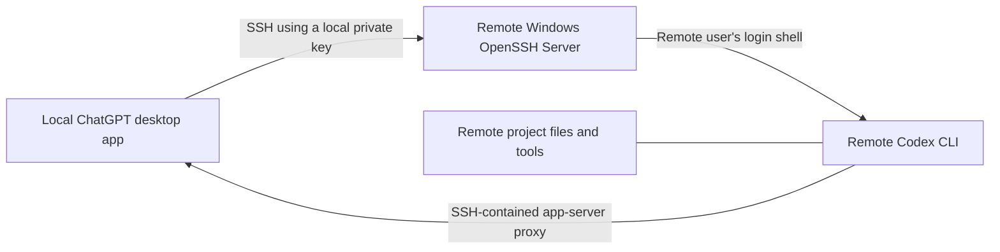

# Codex Remote Projects on Windows over SSH

> A community guide for connecting the ChatGPT desktop app to a project on a remote Windows host through SSH—without exposing Codex app-server traffic to the public internet.

[繁體中文](README.zh-TW.md)

> **Scope:** This is community documentation, not an official OpenAI project. It is a Windows reference for SSH remote projects—not a universal solution for every non-Linux host. It does not control a Windows desktop or bypass normal Windows authorization.

## 中文摘要：為什麼這個專案值得存在

**這不是另一份 SSH 指令清單；它補上的是「已經以 public key 登入」與「Codex 真正在正確的 Windows 工作環境內可靠執行」之間，最常被忽略的一層。**

OpenAI 的 SSH 遠端專案文件已清楚定義基線：使用具名 SSH alias、先確認可登入，並讓遠端使用者的登入 shell 能找到 Codex CLI。在 Windows 上，這些條件全部成立後仍可能失敗：帳號選錯、cmd.exe 先把 POSIX bootstrap 拆壞、互動 shell 輸出雜訊，或是為了「先連上」而不小心放寬防火牆與憑證管理。本專案把這些真實、可重現的斷點整理成可驗證的操作路徑，而不是要求使用者猜測。

### 來自現場的 Windows 痛點

| 現場現象 | 為什麼一般 SSH 教學不夠 | 本專案的處理方式 |
| --- | --- | --- |
| 顯示 publickey 已驗證，接著卻出現 unexpected EOF、引號錯誤或亂碼 | 金鑰驗證成功不代表 Windows 的預設命令直譯器能正確傳遞 POSIX 多行 bootstrap | 分開驗證金鑰、登入 shell、內層 shell 與乾淨 stdio，並把 bridge 視為進階、可審查的替代方案 |
| 連上同一台電腦，卻看不到預期專案、Codex 狀態或桌面帳號資料 | SSH 的 User 決定的是 Windows profile，不是單純的主機名稱 | 先鎖定「目標桌面帳號」，以一個具名 alias 對應一個帳號，保留舊 alias 作為 recovery path |
| codex --version 通過，但 Desktop 仍卡住或 socket hangup | 版本檢查無法證明 app-server bootstrap、SHELL 與 protocol stdio 全部正確 | 使用分層 preflight 與無原始協定內容的診斷原則，先查活著的程序與 socket，不盲目刪除 |
| 為了排錯而加入 echo、shell profile、代理日誌或關閉防火牆 | 對 app-server 而言，stdout/stderr 本身就是協定通道；快速修法可能使問題更糟，也會暴露資料 | 明確禁止 raw protocol logging、密碼、私鑰與公開 app-server endpoint；網路僅限 LAN、VPN 或 mesh |

### 這個專案的價值，不只是「讓它連上」

- **以 Windows profile 為中心：** 先確認真正擁有專案、工具與 Codex 登入狀態的桌面帳號，再建立 SSH 對應；這避免了「其實連到另一個帳號」的隱性失敗。
- **以安全為預設：** 保留 recovery key、使用 least-privilege 帳號、限制網路暴露、驗證 host fingerprint，且不把密碼、私鑰、token、真實主機資料或 raw session log 放進文件與設定。
- **以可驗證性取代猜測：** 每個步驟都有可觀察的成功條件；publickey 成功、codex --version 成功、bootstrap 成功是不同的驗證層次。
- **以透明實作取代黑盒工具：** reference bridge 是 source-only、可審查、沒有預編譯執行檔，也不會自動改寫 SSH 設定。它保留 SSH 的原始 stdin/stdout/stderr，而不是把協定資料重新序列化。

### 長期方向：把新的相容性問題轉成可重現的改善

這是一個由真實 Windows SSH/Codex 排錯經驗推動的開源文件專案。遇到新的失敗模式時，目標不是用一次性的機器設定把它藏起來，而是把它整理為「症狀 → 安全檢查 → 根因邊界 → 可回復的修正」。這讓後來的 Windows 使用者少走彎路，也讓維護者能在不犧牲憑證與網路安全的前提下逐步提高相容性。

**給快速審查者的英文摘要：** This project turns real Windows SSH/Codex failure modes into a privacy-preserving, reproducible, security-first guide. It focuses on the gap between successful key authentication and a reliable remote Codex project, while keeping account boundaries, recovery access, and protocol integrity explicit.

## What this is—and is not

| Feature | Covered here? | Meaning |
| --- | --- | --- |
| SSH remote projects | Yes | Codex chats run commands and edit files on the remote host. |
| ChatGPT Remote Control | No | A separate device-pairing feature for controlling a signed-in desktop host. |
| Public app-server endpoint | No | Never expose the app-server transport to a public or untrusted shared network. |
| Passwords in configuration | No | Use SSH public-key authentication; never commit passwords, private keys, tokens, or real host details. |

## How it works



The desktop app reads concrete SSH aliases from `~/.ssh/config`, resolves them with OpenSSH, and starts the remote Codex app server through the remote user's login shell. `codex` must therefore be on that shell's `PATH`.

### Account and profile boundary

A reachable SSH host is not enough: the alias's `User` chooses the remote Windows account and therefore its profile, projects, Codex CLI installation, and local authentication state. Treat these as one deliberate mapping:

| Item | Must identify | Why it matters |
| --- | --- | --- |
| SSH alias | One host **and** one `User` | A previously working alias can still log in as the wrong Windows account. |
| Target Windows profile | The account that owns the intended desktop/Codex project | `%USERPROFILE%`, `%LOCALAPPDATA%`, project files, and Codex state are profile-specific. |
| Recovery access | A separate, tested alias/key | Keep it intact while adding or changing a profile-specific Codex connection. |

If the work must run in a particular signed-in Windows desktop profile, select that account first. Do not repoint an existing host alias merely because it reaches the same machine; create a new, clearly named alias for the intended profile and keep the old recovery alias until the new one passes preflight.

## Status and verification boundary

**Last reviewed:** 2026-08-17. This guide is based on community reproductions, not a compatibility guarantee. The optional reference bridge source is experimental and has only local build/self-test coverage in this repository; validate it on an isolated host before relying on it.

| Component | Community reference baseline |
| --- | --- |
| ChatGPT desktop app package | `26.810.7004.0` |
| Remote Codex CLI | `0.147.0` |
| Windows OpenSSH server banner | `9.5p2` |
| Git Bash | `5.3.15` |

OpenAI documents generic SSH-host remote projects: concrete aliases, a usable remote login shell, and `codex` on that shell's `PATH`. It does **not** prescribe Git Bash or endorse a particular Windows bridge. Treat all Windows shell-bridge guidance here as community-tested, advanced troubleshooting.

## Prerequisites

### Local computer

- ChatGPT desktop app with Codex access.
- OpenSSH client.
- A dedicated private SSH key stored only in the local user profile.

### Remote Windows host

- Windows OpenSSH Server, reachable only over LAN, VPN, or a mesh network.
- A known target Windows user profile. If the project must share a particular desktop profile, that exact account must be used by the SSH alias.
- A dedicated, least-privilege Windows user.
- Codex CLI installed and authenticated for that exact remote user/profile.
- A login shell where `codex --version` succeeds.
- A remote project folder.

> Windows note: Windows OpenSSH deployments differ. This guide uses a POSIX-compatible login shell such as Git Bash because the remote bootstrap is shell-oriented. Verify the shell and `PATH` on your own host before adding it to Codex.

## Quick setup

### 1. Choose the target remote Windows profile

Before generating a key or changing an existing SSH alias, write down the intended remote Windows account, project folder, and whether it is the account currently signed in at the target desktop. A host nickname such as `<old-host-alias>` is not an account selection.

If an older alias already reaches the host, treat it as recovery access only until you prove which account it uses. Do not copy a Codex auth file, a private key, or a profile directory from that old account to the new one.

### 2. Create a dedicated SSH key locally

In local PowerShell:

```powershell
ssh-keygen -t ed25519 `
  -f "$env:USERPROFILE\.ssh\id_ed25519_codex_win" `
  -C "codex-windows-remote"
```

Keep `id_ed25519_codex_win` private. Install only `id_ed25519_codex_win.pub` on the remote host.

### 3. Install the public key on the remote host

Using an existing secure administrative route, add the public-key line to:

```text
C:\Users\<remote-user>\.ssh\authorized_keys
```

On Windows, confirm the target account's *effective* `AuthorizedKeysFile` locally before editing: an OpenSSH administrator match rule can select a different file. An administrator can inspect it with `sshd -T -C user=<target-desktop-account>,host=localhost,addr=127.0.0.1`; keep that output private. Do not assume another account's key path is correct.

Use restrictive ownership and ACLs on `.ssh` and `authorized_keys`. Prefer a non-administrator account dedicated to this purpose. Test the key in a second session before changing server authentication policy.

If you administer the SSH server and intend to disable passwords, do that only after key authentication and a recovery path are verified:

```text
PubkeyAuthentication yes
PasswordAuthentication no
KbdInteractiveAuthentication no
```

### 4. Add a concrete SSH alias locally

Create or update `%USERPROFILE%\.ssh\config`:

```sshconfig
Host codex-win-target
    HostName <host-name-or-private-address>
    User <target-desktop-account>
    IdentityFile ~/.ssh/id_ed25519_codex_win
    IdentitiesOnly yes
    PreferredAuthentications publickey
    PasswordAuthentication no
    KbdInteractiveAuthentication no
```

Use a literal, profile-specific alias such as `codex-win-target`; pattern-only `Host` entries are not discoverable by Codex. Do not overwrite an existing alias that may intentionally use another Windows account.

### 5. Verify the target profile before using the desktop app

```powershell
$alias = 'codex-win-target'
ssh -G $alias
ssh -T -o BatchMode=yes $alias "whoami"
ssh -T -o BatchMode=yes $alias "codex --version"
```

Confirm that `whoami` is the intended Windows account, not merely an account that can reach the same host. If it is wrong, stop and create a new profile-specific alias/key; do not reuse the old account's Codex files or tokens.

On the remote login shell, also check:

```bash
command -v codex
codex --version
printf 'SHELL=%s\n' "$SHELL"
```

Then run the [manual preflight](docs/preflight.md). A successful `codex --version` alone can be a false positive on Windows: it does not prove that Codex's multiline POSIX bootstrap, the intended profile's `$SHELL`, and a clean stdio proxy will work.

### 6. Add the remote project in the desktop app

1. Open **Settings → Connections → SSH**.
2. Add or enable `codex-win-target`.
3. Choose the remote project folder.
4. Start a chat in that remote project.

Commands, files, tools, credentials, and approvals belong to the remote host and remote user. Do not manually expose the app-server transport or create a public WebSocket endpoint.

## Windows-specific troubleshooting

| Symptom | Likely meaning | Safe check |
| --- | --- | --- |
| `Permission denied (publickey)` | Key, account, or ACL problem | `ssh -vvv <alias>` |
| The host is absent from the app | Alias is not concrete or config cannot be resolved | `ssh -G <alias>` |
| Authentication succeeds but the expected project, Codex state, or desktop profile is missing | The alias selected a different Windows account | Compare `ssh -G <alias>` with `ssh -T <alias> "whoami"`; create a new alias for the intended profile and retain the old recovery alias |
| Authenticated, then `codex: command not found` | Login-shell `PATH` is incomplete | `command -v codex` on the remote shell |
| `unexpected EOF` or quote errors after authentication | Windows SSH may be passing a POSIX bootstrap through an incompatible command interpreter | Validate the configured login shell and target profile; use a reviewed bridge only as an advanced workaround |
| `codex --version` passes, but Desktop still fails or reports shell noise | `$SHELL` can still point to an incompatible command interpreter, or an interactive shell can emit non-protocol bytes | Run the optional inner-shell probe in the [manual preflight](docs/preflight.md); use a reviewed bridge only if the account-specific path needs it |
| `socket hangup` | Network/sleep/app state, CLI-version drift, noisy shell output, or a stale control process/socket can all contribute | Check reachability, host sleep, Desktop and CLI versions, then sanitized metadata-only logs; never delete a socket owned by a live process |

### Advanced Windows shell workaround

Some Windows OpenSSH installations default to `cmd.exe`, which can corrupt multi-line POSIX shell bootstrap commands. The preferred fix is an administrator-reviewed POSIX-compatible default login shell with a correct `PATH`. Verify it under the selected target profile: changing the server shell alone may not correct a stale `$SHELL` environment variable or interactive-shell diagnostics.

If that is impossible, use a **separate key reserved for the bridge** and a reviewed native bridge that preserves SSH stdin/stdout/stderr unchanged. This does **not** make the key Codex-confined: a bridge that accepts arbitrary `SSH_ORIGINAL_COMMAND` can still execute commands as the remote Windows user if the key is compromised. Keep an unforced recovery key, do not log raw protocol streams, and treat the bridge as an advanced deployment artifact—not a universal copy-paste fix.

The official OpenAI documentation describes SSH-host remote projects, but does not prescribe Git Bash or a particular Windows forced-command bridge.

Read the [bridge boundary and threat model](docs/security-model.md) before deploying an advanced bridge. This repository also includes a source-only, no-password [reference bridge](docs/reference-bridge.md); it ships no prebuilt executable and never changes SSH settings automatically.

## Security checklist

- [ ] The private key stays on the local computer.
- [ ] The repository, SSH config, and logs contain no passwords, private keys, tokens, real hostnames, or IP addresses.
- [ ] Each Codex alias maps to the intended Windows account/profile; a previously working host alias is retained as recovery access until the new profile passes preflight.
- [ ] The remote account is least privilege and separate from an administrator account.
- [ ] NTFS ACLs limit that remote account to the intended project data; Codex auth/token files are never copied between hosts.
- [ ] The SSH host-key fingerprint is verified out of band on first connection; never use `StrictHostKeyChecking=no`.
- [ ] SSH access is limited to LAN, VPN, or mesh networking, and Windows Firewall allows TCP/22 only from the intended private peers. Do not disable the firewall broadly.
- [ ] Codex app-server is never exposed directly on a public or shared network.
- [ ] Logs contain timestamps, exit codes, and source labels only—not raw protocol data or secrets.
- [ ] A normal recovery SSH key/path is tested before any forced-command bridge is enabled.
- [ ] Every key has an owner, an expiry/rotation plan, and a documented revocation step in `authorized_keys`.

## References

- [OpenAI documentation: Remote connections](https://learn.chatgpt.com/docs/remote-connections)

## License

[MIT](LICENSE)
