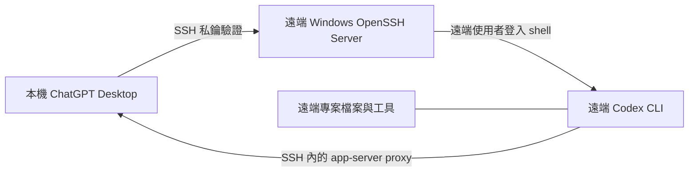

# 透過 SSH 在 Windows 使用 Codex 遠端專案

> **Windows OpenSSH × Codex 遠端專案 × Shell Boundary × Secure Remote Engineering**

> 這是社群文件：讓 ChatGPT Desktop 透過 SSH 連到另一台 Windows 主機上的專案，且不把 Codex app-server 流量公開到網際網路。

[English｜Full technical guide](README.md)

> **範圍：** 這不是 OpenAI 官方專案。本文件是 Windows SSH 遠端專案的參考，不保證適用於每一種非 Linux 主機；它不是遠端桌面控制工具，也不會繞過既有的 Windows 授權機制。

> [!IMPORTANT]
> **專案背景：** 這不是「把兩台電腦連起來」的單點設定，而是從真實的 Windows SSH／Codex 遠端專案失敗中，找出「金鑰已登入」與「遠端工作環境真的可用」之間的工程斷層。這個專案聚焦非 Linux 主機常被忽略的交叉問題：Windows profile、OpenSSH、POSIX shell bootstrap、app-server protocol 與安全邊界必須同時成立。

> [!WARNING]
> **研究與相容性邊界：** 這是社群維護的參考與 source-only bridge，不是 OpenAI 官方相容性保證，也不是可直接部署到所有 Windows 環境的產品。部署前仍需要在隔離主機驗證、保留 recovery path，且不得把密碼、私鑰、token 或原始協定內容寫進 repo 或 log。

## 專案設計摘要：從真實斷點到可驗證的工程方法

我沒有把這題當成「SSH 能通就結束」。真正的問題是：**當 Windows 顯示 publickey 已驗證時，怎麼證明 Codex 會在正確帳號、正確 shell、正確協定邊界內可靠執行？**

| 我看到的困難 | 工程決策 | 工程能力與設計判斷 |
| --- | --- | --- |
| 金鑰驗證成功後仍出現 unexpected EOF、引號錯誤或亂碼 | 將金鑰、登入 shell、內層 shell 與 stdio 拆成獨立驗證層；把 bridge 限定為受審查的進階替代方案 | Windows OpenSSH、shell parsing、跨平台 runtime 診斷 |
| 同一台 Windows 主機卻看不到預期專案、Codex 狀態或桌面資料 | 把一個具名 SSH alias 對應到一個明確 Windows profile，先確認帳號再處理工具與專案 | 帳號邊界、profile state、可回復的系統整合 |
| 只跑 codex --version 不足以保證 Desktop 能啟動遠端工作階段 | 建立從 alias、key-only login、shell PATH、bootstrap 到 app-server 的分層 preflight | 可觀察性、故障隔離、可重現驗證 |
| 排錯時很容易加入 echo、profile banner 或 raw log，反而破壞 protocol | 將 stdin/stdout/stderr 視為協定邊界；診斷只保留去識別化 metadata，不記錄原始命令或 session stream | Protocol integrity、資安設計、最小化記錄 |
| 快速修法常是共用帳號、放寬 firewall 或關掉密碼策略 | 先保留 recovery key、採 least privilege、核對 host fingerprint，並限制 LAN/VPN/mesh 暴露 | 威脅模型、Windows ACL／Firewall、可回復部署 |

## 技術專業摘要

- **Windows 與 OpenSSH：** public-key enrollment、administrators authorized-keys 特例、NTFS ACL、Windows Firewall、服務／登入帳號邊界。
- **Shell 與協定：** POSIX bootstrap 在 Windows command interpreter 的傳遞問題、登入 shell 的 PATH、SHELL 狀態與互動雜訊。
- **透明 bridge 設計：** source-only reference、保留原始 stdin/stdout/stderr、避免重新序列化 protocol，也不發布未審查的二進位檔。
- **安全與可回復性：** recovery key、獨立 alias、least-privilege 帳號、host-key verification、LAN/VPN/mesh 範圍與不公開 app-server。
- **文件化與維護：** 把一次排錯整理成「症狀 → 安全檢查 → 根因邊界 → 可回復修正」，讓後續 Windows 使用者可以重現、審查與改善。


## 這是什麼／不是什麼

| 功能 | 本文件涵蓋？ | 說明 |
| --- | --- | --- |
| SSH 遠端專案 | 是 | Codex 對話會在遠端主機執行指令、讀取與修改檔案。 |
| ChatGPT Remote Control | 否 | 這是另一套已登入桌面主機的裝置配對功能。 |
| 公開 app-server endpoint | 否 | 不應將 app-server transport 暴露到公網或不受信任的共享網路。 |
| 設定內放密碼 | 否 | 使用 SSH 公開金鑰驗證；不要提交密碼、私鑰、Token 或真實主機資料。 |

## 運作架構



Desktop 會從 `~/.ssh/config` 讀取具體 SSH alias、以 OpenSSH 解析，並透過遠端使用者的登入 shell 啟動 remote Codex app-server。因此 `codex` 必須能在該登入 shell 的 `PATH` 找到。

### 帳號與使用者設定檔邊界

SSH 主機可連線還不夠：alias 裡的 `User` 決定遠端 Windows 帳號，也就決定其使用者設定檔、專案、Codex CLI 安裝位置與本機授權狀態。請把下列項目視為同一個明確對應：

| 項目 | 必須先確認 | 為何重要 |
| --- | --- | --- |
| SSH alias | 一台主機**與**一個 `User` | 原本可用的 alias 仍可能登入錯的 Windows 帳號。 |
| 目標 Windows 使用者設定檔 | 擁有預期桌面／Codex 專案的帳號 | `%USERPROFILE%`、`%LOCALAPPDATA%`、專案檔與 Codex 狀態都屬於各自的 profile。 |
| 復原連線 | 另一組已驗證的 alias／key | 新增或改用特定 profile 的 Codex 連線時，保留它。 |

若工作必須在特定已登入的 Windows 桌面 profile 中執行，先選定那個帳號。不要只因為既有 alias 能連到同一台主機就直接改它；應為目標 profile 建立名稱清楚的新 alias，並在它通過 preflight 前保留舊 alias 作為復原路徑。

## 支援狀態與驗證邊界

**最後檢視：** 2026-08-17。本文件源自社群實作環境，不是相容性保證。選用的 reference bridge 原始碼仍是實驗性質；本 repo 目前只有本機 build/self-test 覆蓋，部署前務必先在隔離主機驗證。

| 元件 | 社群參考基線 |
| --- | --- |
| ChatGPT Desktop package | `26.810.7004.0` |
| 遠端 Codex CLI | `0.147.0` |
| Windows OpenSSH server banner | `9.5p2` |
| Git Bash | `5.3.15` |

OpenAI 文件說明的是通用 SSH 遠端專案：具體 alias、可用的遠端登入 shell，以及該 shell 的 `PATH` 能找到 `codex`。它**沒有**指定 Git Bash，也沒有認可特定的 Windows bridge。本文件中的 Windows shell bridge 都應視為經社群測試的進階排錯方式。

## 前置條件

### 本機電腦

- 有 Codex 存取權的 ChatGPT Desktop。
- OpenSSH client。
- 僅存在於本機使用者設定檔的專用 SSH 私鑰。

### 遠端 Windows 主機

- 正在執行 Windows OpenSSH Server，且只能由 LAN、VPN 或 mesh network 到達。
- 一個已確認的目標 Windows 使用者設定檔；若專案要與特定桌面 profile 共用，SSH alias 必須使用該帳號。
- 一個低權限的專用 Windows 帳號。
- 已在該**正確遠端帳號／profile**下安裝並完成授權的 Codex CLI。
- 一個能成功執行 `codex --version` 的登入 shell。
- 遠端專案資料夾。

> Windows 注意事項：各台機器的 OpenSSH 設定不同。本文件以 Git Bash 這類 POSIX 相容 shell 為例，因為 remote bootstrap 是以 shell 為中心。加入 Codex 前，請先在自己的主機確認 shell 與 `PATH`。

## 快速設定

### 1. 先選擇目標遠端 Windows profile

建立金鑰或修改既有 SSH alias 前，先寫下預期的遠端 Windows 帳號、專案資料夾，以及它是否就是目標電腦目前登入桌面的帳號。像 `<old-host-alias>` 這類主機暱稱不是帳號選擇。

若舊 alias 已能連到主機，在確認它登入哪個帳號之前，只把它當成復原連線。不要從舊帳號複製 Codex auth、私鑰或整個 profile 到新帳號。

### 2. 在本機建立專用 SSH 金鑰

在本機 PowerShell 執行：

```powershell
ssh-keygen -t ed25519 `
  -f "$env:USERPROFILE\.ssh\id_ed25519_codex_win" `
  -C "codex-windows-remote"
```

`id_ed25519_codex_win` 是私鑰，僅留在本機。遠端只能安裝 `id_ed25519_codex_win.pub`。

### 3. 在遠端安裝公開金鑰

透過既有且安全的管理管道，將公開金鑰的完整單行內容加入：

```text
C:\Users\<remote-user>\.ssh\authorized_keys
```

在 Windows 上編輯前，先在本機確認目標帳號**實際套用的** `AuthorizedKeysFile`：OpenSSH 的 administrator match rule 可能選用不同檔案。管理員可用 `sshd -T -C user=<target-desktop-account>,host=localhost,addr=127.0.0.1` 查核；輸出請自行保留。不可假設另一個帳號的 key path 也正確。

`.ssh` 與 `authorized_keys` 要有嚴格的擁有者與 ACL。建議使用專用的一般帳號，不要使用管理員帳號。改動 server 驗證規則前，務必先以另一個工作階段驗證金鑰連線。

若你管理 SSH server 且要關閉密碼驗證，請只在金鑰與復原管道都驗證成功後設定：

```text
PubkeyAuthentication yes
PasswordAuthentication no
KbdInteractiveAuthentication no
```

### 4. 在本機建立具體 SSH alias

建立或修改 `%USERPROFILE%\.ssh\config`：

```sshconfig
Host codex-win-target
    HostName <host-name-or-private-address>
    User <target-desktop-account>
    IdentityFile ~/.ssh/id_ed25519_codex_win
    IdentitiesOnly yes
    PreferredAuthentications publickey
    PasswordAuthentication no
    KbdInteractiveAuthentication no
```

請使用像 `codex-win-target` 這樣具體、且能辨識 profile 的 alias；只有 pattern 的 `Host` 項目不會被 Codex 自動發現。不要覆寫可能刻意使用另一個 Windows 帳號的既有 alias。

### 5. 在開啟 Desktop 前驗證目標 profile

```powershell
$alias = 'codex-win-target'
ssh -G $alias
ssh -T -o BatchMode=yes $alias "whoami"
ssh -T -o BatchMode=yes $alias "codex --version"
```

確認 `whoami` 顯示的是預期 Windows 帳號，而不是只要能登入同一台主機的另一個帳號。若不正確，請停止並建立新的 profile 專用 alias／key；不要重用舊帳號的 Codex 檔案或 token。

登入遠端 shell 後，也應確認：

```bash
command -v codex
codex --version
printf 'SHELL=%s\n' "$SHELL"
```

接著執行[手動 preflight](docs/preflight.zh-TW.md)。單靠 `codex --version` 成功可能是 Windows 的假陽性：它不能證明 Codex 的多行 POSIX bootstrap、目標 profile 的 `$SHELL` 與乾淨的 stdio proxy 能正常運作。

### 6. 在 Desktop 加入遠端專案

1. 開啟 **Settings → Connections → SSH**。
2. 新增或啟用 `codex-win-target`。
3. 選擇遠端專案資料夾。
4. 在該遠端專案中開始對話。

指令、檔案、工具、認證與核准都屬於遠端主機及遠端帳號。不要手動公開 app-server transport，也不要建立公網 WebSocket endpoint。

## Windows 特有的排錯

| 現象 | 最可能意義 | 安全檢查方式 |
| --- | --- | --- |
| `Permission denied (publickey)` | 金鑰、帳號或 ACL 有問題 | `ssh -vvv <alias>` |
| Desktop 看不到主機 | alias 不具體，或設定無法解析 | `ssh -G <alias>` |
| 已驗證成功，但看不到預期的專案、Codex 狀態或桌面 profile | alias 選到了另一個 Windows 帳號 | 比對 `ssh -G <alias>` 與 `ssh -T <alias> "whoami"`；為目標 profile 建立新 alias，並保留舊 alias 作為復原連線 |
| 已驗證但出現 `codex: command not found` | 登入 shell 的 `PATH` 不完整 | 在遠端 shell 執行 `command -v codex` |
| 驗證後出現 `unexpected EOF` 或引號錯誤 | Windows SSH 可能將 POSIX bootstrap 交給不相容的命令直譯器 | 檢查登入 shell 與目標 profile；bridge 只應作為進階且經檢視的 workaround |
| `codex --version` 已通過，但 Desktop 仍失敗或出現 shell 雜訊 | `$SHELL` 仍可能指向不相容的命令直譯器，或互動 shell 輸出非協定位元組 | 執行[手動 preflight](docs/preflight.zh-TW.md)中的選用內層 shell probe；只有特定帳號路徑確實需要時才使用經檢視的 bridge |
| `socket hangup` | 網路、休眠、Desktop／CLI 版本差異、shell 雜訊或殘留 control process/socket 都可能造成 | 先檢查連線、主機休眠、Desktop 與 CLI 版本，再看去識別化 metadata；不可刪除仍被活程序使用的 socket |

### 進階：Windows shell bridge

有些 Windows OpenSSH 安裝會預設使用 `cmd.exe`，它可能破壞多行 POSIX bootstrap 指令。首選方案是讓管理員設定一個受審核、POSIX 相容且 `PATH` 正確的預設登入 shell。必須在選定的目標 profile 下驗證：只改 server shell 未必能修正殘留的 `$SHELL` 環境變數或互動 shell 診斷訊息。

若無法這麼做，請使用**專門保留給 bridge 的獨立 key**與經檢視的 native bridge。它必須原樣傳遞 SSH 的 stdin/stdout/stderr；但這不代表 key 被限制為只能操作 Codex：若 bridge 接受任意 `SSH_ORIGINAL_COMMAND`，key 遭竊時仍可能以遠端 Windows 使用者身分執行指令。保留未 forced 的復原 key；不可記錄原始 protocol stream。bridge 應被視為進階部署工件，不是通用的複製貼上解法。

官方 OpenAI 文件說明 SSH 遠端專案，但沒有指定 Git Bash 或特定 Windows forced-command bridge。

部署進階 bridge 前，請先閱讀 [bridge 邊界與威脅模型](docs/security-model.zh-TW.md)。本 repo 另有不含密碼的 [reference bridge 原始碼](docs/reference-bridge.zh-TW.md)：不發佈預編譯執行檔，也不會自動修改 SSH 設定。

## 安全檢查清單

- [ ] 私鑰只保留在本機。
- [ ] Repo、SSH config 與 log 沒有密碼、私鑰、Token、真實主機名稱或 IP。
- [ ] 每個 Codex alias 都對應到預期 Windows 帳號／profile；新 profile 通過 preflight 前，原本可用的主機 alias 仍保留作為復原連線。
- [ ] 遠端帳號是低權限帳號，並與管理員帳號分開。
- [ ] NTFS ACL 將遠端帳號限制在預期的專案資料；不可在主機之間複製 Codex auth/token 檔案。
- [ ] 首次連線以獨立管道核對 SSH host-key fingerprint；絕不可設定 `StrictHostKeyChecking=no`。
- [ ] SSH 僅限 LAN、VPN 或 mesh network，且 Windows Firewall 的 TCP/22 僅允許預期的私有端點；不可廣泛停用防火牆。
- [ ] Codex app-server 未直接暴露在公網或共享網路。
- [ ] log 僅記錄時間、結束碼與來源標籤，不記錄原始 protocol 或 secrets。
- [ ] 啟用 forced-command bridge 前，已測試一般的復原 SSH key／路徑。
- [ ] 每把 key 都有擁有者、到期／輪替計畫，以及 `authorized_keys` 的撤銷步驟。

## 參考資料

- [OpenAI 文件：Remote connections](https://learn.chatgpt.com/docs/remote-connections)

## 授權條款

[MIT](LICENSE)
