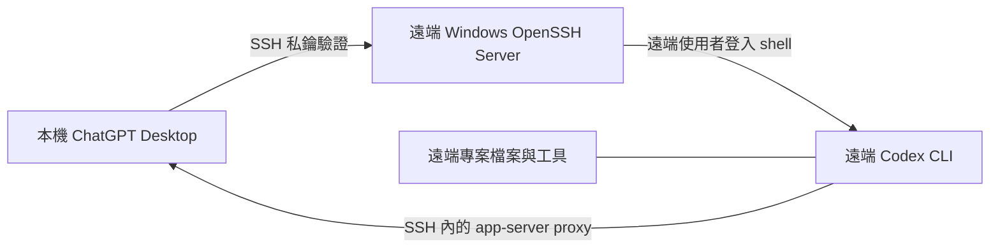

# 透過 SSH 在 Windows 使用 Codex 遠端專案

> 這是社群文件：讓 ChatGPT Desktop 透過 SSH 連到另一台 Windows 主機上的專案，且不把 Codex app-server 流量公開到網際網路。

[English](README.md)

> **範圍：** 這不是 OpenAI 官方專案。本文件是 Windows SSH 遠端專案的參考，不保證適用於每一種非 Linux 主機；它不是遠端桌面控制工具，也不會繞過既有的 Windows 授權機制。

## 這是什麼／不是什麼

| 功能 | 本文件涵蓋？ | 說明 |
| --- | --- | --- |
| SSH 遠端專案 | 是 | Codex 對話會在遠端主機執行指令、讀取與修改檔案。 |
| ChatGPT Remote Control | 否 | 這是另一套已登入桌面主機的裝置配對功能。 |
| 公開 app-server endpoint | 否 | 不應將 app-server transport 暴露到公網或不受信任的共享網路。 |
| 設定內放密碼 | 否 | 使用 SSH 公開金鑰驗證；不要提交密碼、私鑰、Token 或真實主機資料。 |

## 運作架構



Desktop 會從 `~/.ssh/config` 讀取具體 SSH alias、以 OpenSSH 解析，並透過遠端使用者的登入 shell 啟動 remote Codex app-server。因此 `codex` 必須能在該登入 shell 的 `PATH` 找到。

## 支援狀態與驗證邊界

**最後檢視：** 2026-08-16。本文件源自一套社群實作環境，不是相容性保證。選用的 reference bridge 原始碼仍是實驗性質；本 repo 目前只有本機 build/self-test 覆蓋，部署前務必先在隔離主機驗證。

| 元件 | 社群參考基線 |
| --- | --- |
| ChatGPT Desktop package | `26.810.7004.0` |
| 遠端 Codex CLI | `0.147.0` |
| Windows OpenSSH server banner | `9.5p2` |
| Git Bash | `5.3.15` |

OpenAI 文件說明的是通用 SSH 遠端專案：具體 alias、可用的遠端登入 shell，以及該 shell 的 `PATH` 能找到 `codex`。它**沒有**指定 Git Bash，也沒有認可特定的 Windows bridge。本文件中的 Windows shell bridge 都應視為經社群測試的進階排錯方式。

## 前置條件

### 本機電腦

- 有 Codex 存取權的 ChatGPT Desktop。
- OpenSSH client。
- 僅存在於本機使用者設定檔的專用 SSH 私鑰。

### 遠端 Windows 主機

- 正在執行 Windows OpenSSH Server，且只能由 LAN、VPN 或 mesh network 到達。
- 一個低權限的專用 Windows 帳號。
- 已在該遠端帳號下安裝並完成授權的 Codex CLI。
- 一個能成功執行 `codex --version` 的登入 shell。
- 遠端專案資料夾。

> Windows 注意事項：各台機器的 OpenSSH 設定不同。本文件以 Git Bash 這類 POSIX 相容 shell 為例，因為 remote bootstrap 是以 shell 為中心。加入 Codex 前，請先在自己的主機確認 shell 與 `PATH`。

## 快速設定

### 1. 在本機建立專用 SSH 金鑰

在本機 PowerShell 執行：

```powershell
ssh-keygen -t ed25519 `
  -f "$env:USERPROFILE\.ssh\id_ed25519_codex_win" `
  -C "codex-windows-remote"
```

`id_ed25519_codex_win` 是私鑰，僅留在本機。遠端只能安裝 `id_ed25519_codex_win.pub`。

### 2. 在遠端安裝公開金鑰

透過既有且安全的管理管道，將公開金鑰的完整單行內容加入：

```text
C:\Users\<remote-user>\.ssh\authorized_keys
```

`.ssh` 與 `authorized_keys` 要有嚴格的擁有者與 ACL。建議使用專用的一般帳號，不要使用管理員帳號。改動 server 驗證規則前，務必先以另一個工作階段驗證金鑰連線。

若你管理 SSH server 且要關閉密碼驗證，請只在金鑰與復原管道都驗證成功後設定：

```text
PubkeyAuthentication yes
PasswordAuthentication no
KbdInteractiveAuthentication no
```

### 3. 在本機建立具體 SSH alias

建立或修改 `%USERPROFILE%\.ssh\config`：

```sshconfig
Host codex-win
    HostName <host-name-or-private-address>
    User <remote-user>
    IdentityFile ~/.ssh/id_ed25519_codex_win
    IdentitiesOnly yes
    PreferredAuthentications publickey
    PasswordAuthentication no
    KbdInteractiveAuthentication no
```

請使用像 `codex-win` 這樣具體的 alias；只有 pattern 的 `Host` 項目不會被 Codex 自動發現。

### 4. 在開啟 Desktop 前驗證

```powershell
ssh -o BatchMode=yes codex-win "codex --version"
ssh -G codex-win
```

登入遠端 shell 後，也應確認：

```bash
command -v codex
codex --version
printf 'SHELL=%s\n' "$SHELL"
```

接著執行[手動 preflight](docs/preflight.zh-TW.md)。單靠 `codex --version` 成功可能是 Windows 的假陽性：它不能證明 Codex 的多行 POSIX bootstrap 與乾淨的 stdio proxy 能正常運作。

### 5. 在 Desktop 加入遠端專案

1. 開啟 **Settings → Connections → SSH**。
2. 新增或啟用 `codex-win`。
3. 選擇遠端專案資料夾。
4. 在該遠端專案中開始對話。

指令、檔案、工具、認證與核准都屬於遠端主機及遠端帳號。不要手動公開 app-server transport，也不要建立公網 WebSocket endpoint。

## Windows 特有的排錯

| 現象 | 最可能意義 | 安全檢查方式 |
| --- | --- | --- |
| `Permission denied (publickey)` | 金鑰、帳號或 ACL 有問題 | `ssh -vvv codex-win` |
| Desktop 看不到主機 | alias 不具體，或設定無法解析 | `ssh -G codex-win` |
| 已驗證但出現 `codex: command not found` | 登入 shell 的 `PATH` 不完整 | 在遠端 shell 執行 `command -v codex` |
| 驗證後出現 `unexpected EOF` 或引號錯誤 | Windows SSH 可能將 POSIX bootstrap 交給不相容的命令直譯器 | 檢查登入 shell；bridge 只應作為進階且經檢視的 workaround |
| `socket hangup` | 網路、休眠、Desktop／CLI 版本差異、shell 雜訊或殘留 control process/socket 都可能造成 | 先檢查連線、主機休眠、Desktop 與 CLI 版本，再看去識別化 metadata；不可刪除仍被活程序使用的 socket |

### 進階：Windows shell bridge

有些 Windows OpenSSH 安裝會預設使用 `cmd.exe`，它可能破壞多行 POSIX bootstrap 指令。首選方案是讓管理員設定一個受審核、POSIX 相容且 `PATH` 正確的預設登入 shell。

若無法這麼做，請使用**專門保留給 bridge 的獨立 key**與經檢視的 native bridge。它必須原樣傳遞 SSH 的 stdin/stdout/stderr；但這不代表 key 被限制為只能操作 Codex：若 bridge 接受任意 `SSH_ORIGINAL_COMMAND`，key 遭竊時仍可能以遠端 Windows 使用者身分執行指令。保留未 forced 的復原 key；不可記錄原始 protocol stream。bridge 應被視為進階部署工件，不是通用的複製貼上解法。

官方 OpenAI 文件說明 SSH 遠端專案，但沒有指定 Git Bash 或特定 Windows forced-command bridge。

部署進階 bridge 前，請先閱讀 [bridge 邊界與威脅模型](docs/security-model.zh-TW.md)。本 repo 另有不含密碼的 [reference bridge 原始碼](docs/reference-bridge.zh-TW.md)：不發佈預編譯執行檔，也不會自動修改 SSH 設定。

## 安全檢查清單

- [ ] 私鑰只保留在本機。
- [ ] Repo、SSH config 與 log 沒有密碼、私鑰、Token、真實主機名稱或 IP。
- [ ] 遠端帳號是低權限帳號，並與管理員帳號分開。
- [ ] NTFS ACL 將遠端帳號限制在預期的專案資料；不可在主機之間複製 Codex auth/token 檔案。
- [ ] 首次連線以獨立管道核對 SSH host-key fingerprint；絕不可設定 `StrictHostKeyChecking=no`。
- [ ] SSH 僅限 LAN、VPN 或 mesh network，且 Windows Firewall 的 TCP/22 僅允許預期的私有端點；不可廣泛停用防火牆。
- [ ] Codex app-server 未直接暴露在公網或共享網路。
- [ ] log 僅記錄時間、結束碼與來源標籤，不記錄原始 protocol 或 secrets。
- [ ] 啟用 forced-command bridge 前，已測試一般的復原 SSH key／路徑。
- [ ] 每把 key 都有擁有者、到期／輪替計畫，以及 `authorized_keys` 的撤銷步驟。

## 參考資料

- [OpenAI 文件：Remote connections](https://learn.chatgpt.com/docs/remote-connections)

## 授權條款

[MIT](LICENSE)
